 # How I learned Vue and built an Agentic chart app over the weekend 

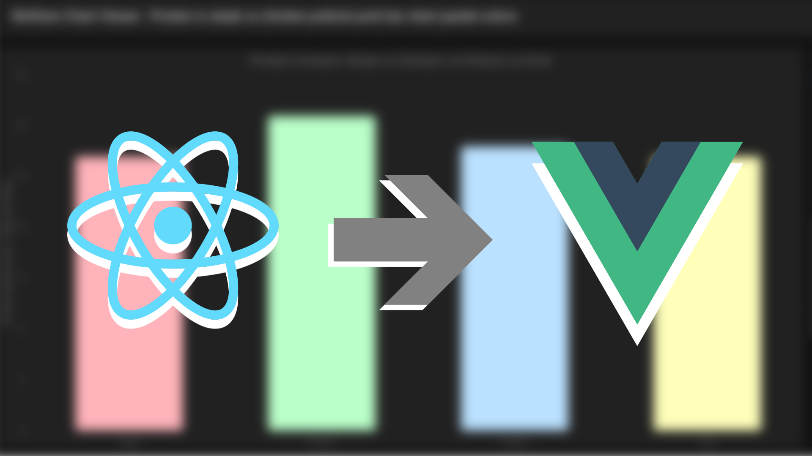
I come
from a React background, and haven't built a Vue application before!

There's always the puzzle of taking on new frameworks; nearly
infinite possibilities arise when it comes to solving just one thing.
That's *more* than true with something like the JavaScript
ecosystem.

Crossing wires between frameworks though? What does it take in
this day of age, and how far can you take it? Are there some
techniques in both the framework and how *you* understand
things that help to re-think how to shape apps and how they operate?
Say, what about that fangled AI stuff? Could there *actually*
be some use to integrating it deeper than just a developer's coding
workflow?

After engaging with all these questions, I can say with absolute
certainty, *yes*, to **everything**. Today, I'll
be giving you the grand tour of a [new
application](https://github.com/zachMitchellAI/wolfram-chart-viewer) created by the power of coding, music, learning,
brushing off old techniques, learning ton of new ones, and pulling
that all in together for a learning opportunity that rocked my world
and helped introduce me to a world of cool new abilities.

## Welcome to the wolfram chart viewer

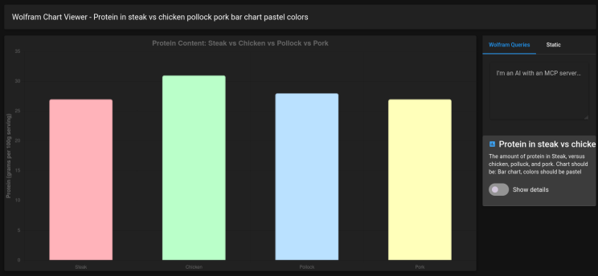

[Here
it is](https://github.com/zachMitchellAI/wolfram-chart-viewer) - and you might be wondering... what this thing is supposed
to do?

Great question, it's main purpose is to view data from [wolfram
alpha](https://www.wolframalpha.com/) - so a special search engine built from the ground up to
ask all sort of quick questions you might ask from a google search:

> How many calories are in a hamburger?

> How popular is the name "George"?

> How many shades of purple are there?

> When did Abraham Lincoln become president?

*However*, this char viewer in particular has two twists:

* You can combine multiple queries together through an **agentic
  query** (langchain!)
* The resulting output *also* comes from that same
  agentic query

What does that mean in practice? That means wolfram instantly
becomes a much more powerful resource. Instead of those single
queries and static images for charts you get on base wolfram, you
instead can run a query like so:

> Compare the amount of vitamin C in an apple, orange, and grapes. Must be a donut chart... set the colors to be the color of the fruit!

And just like that, a special chart is made based on exactly that
criteria:

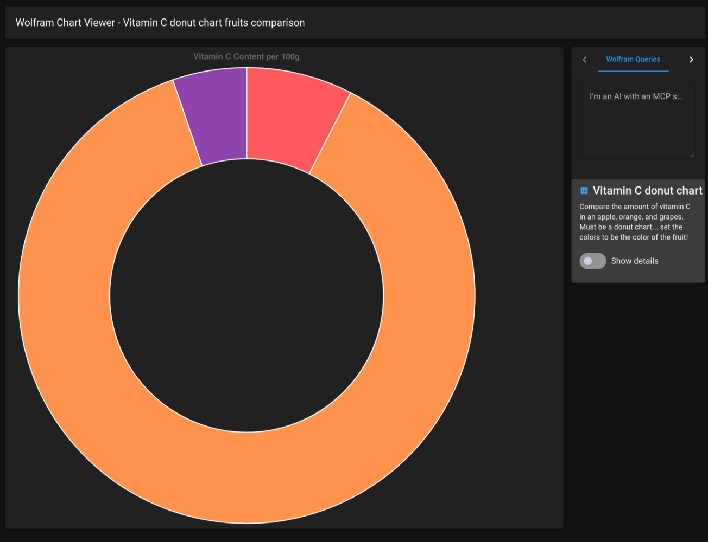

This is a fresh chart made specifically to share on this blog
post. The time it took to generate was roughly 7 seconds.

## So, how was it made?

That's a big question, but it's also the beef of the rest of this
post! We'll break this down into different parts:

* Challenges to be faced
* Learning Process
* Implementation Process
* Agentics & Langchain
* Learning to use my own app
* Planned future upgrades
* Retrospect

I've been wanting to show coding practices for a while now on this
blog, it's gonna be a very interesting one because we have an actual
codebase to talk about!

Lets get into the meat & potatoes shall we?!

---

## Challenges to be faced

### Vue

Well... that's certainly a big one! My brain is native to react;
this means trying to change out the mindset to really dig into what
matters for a vue application.

Though, it's not just a simple framework change; there are a lot
other stuff that bring icing onto the large cake:

* Nextjs -> Nuxt
* Redux / Zustand -> pinia
* Matrial UI -> Vuetify

For each of these, plus other technologies that might not be easy
to remember off the top of your head, there's a very important
element in this mix: Documentation and Explanation.

Everyone's talking about vibe-coding, but here's the thing; if you
don't understand the elements you're working with, the less the power
of vibe-coding will really have it's effect. Because of this, **I
built a lot of this by hand** to grasp the core concepts.
However, that doesn't mean agentic help was not in the mix, in fact
it was crucial to help get me unstuck in many places I didn't
understand.

For documentation, every technology had a tab open in my browser,
and got very specific to help me know what route I was going to take.
During the peak of this exercise, I had over 20 tabs open all at
once, which honestly... is pretty normal when you think about it -
web searches, references to that one niche variable or concept, it
was all present in the heat of the moment.

So, just "learning vue" when you "know react"
doesn't really fit into those two words (more like 3-5 paragraphs and
3 bullet points!). Seeing this, and utilizing it are very different
stories. I at least wanted to see the magic of a shadow dom naturally
in it's habitat, react doesn't have this, as it has it's own DOM
system all-together.

Though, there was another thing i wanted to see, but this time...
a *second* time

### Chart.js

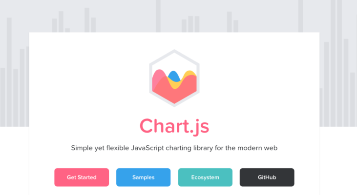

This is a library that I used once upon a time from previous
endeavors! [Chart.js specifically](https://www.chartjs.org/),
is very strong - it provides a ton of different graphing options,
including bar, bubble, donut, line, and scatter plotting.

However, it's been over half a decade since using it!

Re-learning this was going to be a process, but it is still
actively being developed and is loved on by the community, I knew I'd
be in good hands to make another project using this. Combining it
with modern frameworks feels like it represents the spirit of apps I
worked on previously, but stronger and more powerful with technology
that wasn't even a twinkle of an eye yet.

Speaking of new technologies...

### LangChain

What if we combined a new technology alongside an old one?
Actually wait... what in the world is this thing in the first place?

**Langchain** is a bridge between LLMs, and and a
real-world application. Ever wonder how people make apps online that
either talk to a chatbot or return back with results on the fly after
speaking to a prompt in natural english?

*This is that underlying technology*, in other words, your
inputs go into this library, and out it comes from a response from
the likes of GLM5.2, google's gemma, or perhaps even Anthropic Claude
models (opus) or OpenAI's chatGPT models. In comes some text, out
pops through a refined result.

We can do a lot more than just chat back with this library though
- MCP servers can be attached, and more importantly, *multiple
calls* to those MCP servers. In other words, real data comes back
after as many lookups as necessary.

It's a powerful beast in today's era - the goal for this project
was to make it do two things:

1. Grab data from <https://wolfram.com/>
2. Output it into graph data that [Chart.js](https://www.chartjs.org/)
   can parse and provide an interactive graph

If we can do that, then there's a lot of things we share &
display!

Except... I haven't used it before in an actual project yet! A
quick python course, sure, but we're in TypeScript land. This means
while the library looks roughly the same, we'd need to understand how
to have an LLM can structure it's resulting output (Zod! More on that
later) Doing this beyond the textbook will be interesting, because
it's the difference between conceptual understanding and walking the
talk.

### Technique: Pomodoro

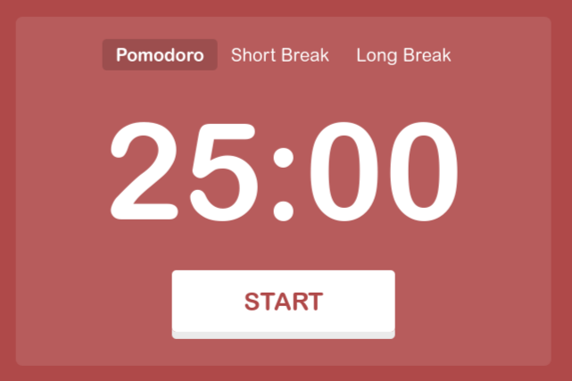

Less of a challenge, more of a useful technique I picked up from a
previous co-worker! it's a series of 25 minute sessions of learning &
doing, followed by a 5 minute break.

Doing this allowed me to also record what I work on in each
session. Progress is tracked, with detailed notes on what's coming
up. My mind can't hold everything in at once, so having a scratch pad
of sorts (mostly a markdown file), helps me to jot down thoughts, and
specific details I may need later (or in honesty, it's a way to put
down a thought stream so that it's more potent while I actually think
of it).

It's a classic technique I've been using for a good few years.
Helps me keep paced, understand progress, and avoids feelings of time
going into a void! You actually get to *see* the progress, and
boy was there a lot.

There are some good applications for this by the way:

* [https://pomofocus.io](https://pomofocus.io/) is a
  free one used on the web
* Windows 10 and up have the "focus" timers built-in
* My personal favorite, even thought its not explicitly a
  pomodoro timer: termdown, which is a python script which turns your
  terminal into an ascii timer or stopwatch!

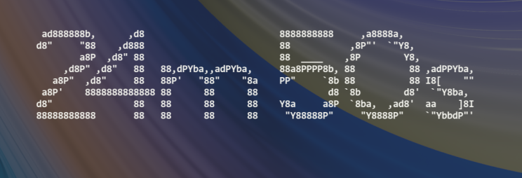

---

With all that said, each thing has it's own dynamics that needed
to be faced. From new technologies, to old ones, to documenting that
process with a pomodoro hybrid, it's a process that required a lot of
consideration for getting this application to work.

Is it ultimately perfect? *No*, however I believe that with
the time I had, and what it can do right now, it's very capable. Over
the coming weeks I'll be setting myself out to iron much of the
things I wanted to accomplish in the initial build-out, and will be
sharing this progress along the way.

I share this, because I believe the *process* matters.
Restrictions brought it to where the state is now; nonetheless, the
outlook of new things to come will equally be interesting, as they
will feature things I'm passionate about! The whole thing will be
shared: pros, cons, and improvements that will be applied to this
codebase.

Let's dive into the first part of this process we're sharing
today:

## Learning Process

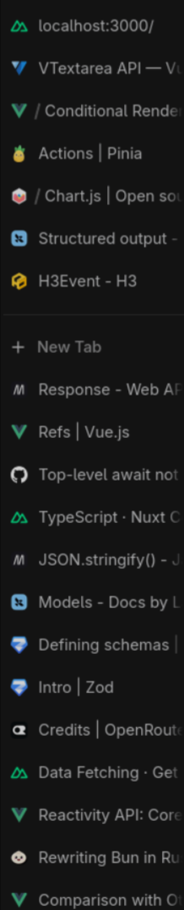

The above image was from my web browser during the heat of the
moment. You can see a lot of things inside, including bun, zod, and
even little things like that H3 tab (that's how nuxt handled their
API response objects). Each of those things were being understood &
parsed on the fly. Whenever there was something I didn't understand,
the first question to ask was "what is that?"

Given that (mostly) all this was new material, that's a question
that was asked every other minute of each pomodoro session. No
compromises - this *has* to be asked, or else intentions
(either to yourself, or others) won't be understood.

I would love for context to just *be*, but we're talking
new material, and I'm not omniscient of all JS concepts. I've got the
core down, that's part of how I've been learning for years. For this
to work, in addition to documentation, I had the help of something
else

### Learning by LLM

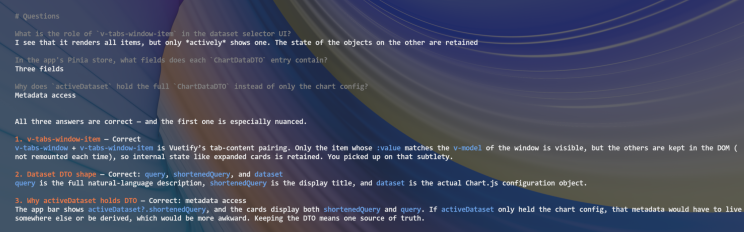

Here's a little bit of my setup from a late evening. If that title
above sounds familiar, [we
covered this on linkedIn previously!](https://www.linkedin.com/pulse/llm-standards-preserving-knowledge-zachary-mitchell-bceqc/) I don't really just want an
LLM to magically do all the work and my mind lack any knowledge of
what even happened. Especially when learning something new; there
would be nothing to show if everything was just vibe-coded without
thought.

Therefore I had a mix of procedures done with LLMs in this case:

* Ask it about things I haven't seen before to put a name to it
* Have it analyze what a problem is without directly going in
  to solve it
* If it *does* solve it by editing the code, quiz me on
  it!

That last one is a [not-so-secret
sauce of a routine](https://github.com/zachMitchellAI/ai-knowledge-base/blob/master/.opencode/commands/quiz-me.md) that I've openly shared in my personal
repository. The command is simple, come up with 3-4 questions with a
few multi-choice answers related to what was just built. If I get it
wrong, I have some learning to do and I can ask questions. Get it
right and we move onto new concepts that are harder. It's a dynamic
quiz that allows one to get *very* specialized learning.

That quiz doesn't have to just be about code either. It can be a
core concept, from documentation, etc. It's powerful enough so that
it even shares places to look at things on my own. It did a great job
at showing some plotholes that I *did in fact* miss.

Now, there's one other concept that made it crucial to either
learn or implement, namely, **MCP servers.** These
connect the model to real documentation. I used a plethora of 'em
right here:

* context7
* docs-langchain
* reference-langchain
* nuxt
* brave-search

Those **framework specific** ones are important.
While we do have an over-arching context7 right there (it grabs
documentation from all the things), these others provide the LLM much
more hydrated (up to date) information.

It's more important than you think, the LLM might say "oh,
you can just do this" without referencing anything, and then
visit the docs only to say "Wait, the docs actually say this!
Now I understand the full context".

Sound familiar? It's a lot like my 20 open browser tabs! Only it's
for the LLM. Though, the LLM is getting all of this to:

* Teach me
* Also implement in some cases

When teaching me, it's essential for those smaller questions,
"what's the difference between @ and : when setting up props in
a vue component", for example. That I might not have a direct
reference point to in documentation, or if there *is*, the LLM
can easily reference *back* to where it found that question,
and thus, allow for tab #21 to proliferate in my browser for deeper
reading.

The thing I easily think people miss, is that LLMs should not
replace your learning entirely. You need a full picture, docs,
building yourself, those intricate questions, and plotholes pointed
out that you missed. LLMs do the favor of contextualizing information
from as many sources as you can provide (or, just simply enough
resources to prevent context bloat), so that it can work for you.
Everyone learns differently, I know for one that my mind can easily
fixate on something, but getting out of that is crucial. LLMs
therefore become a partner in crime when trying to contextualize the
whole enchilada. As long as you're learning the concepts and you're
causing an impact inside & out, it's a force that can't be
reckoned with.

### Debugging all the things

Of course, problems are gonna arise, that's the piece no-one sees
when building things. Long ago I remember always wondered what it was
like to see an app magically go from one version to another.

Well, that's just it - you aren't going from one large version to
another, you're making and breaking so many things to the point where
it might take a good while to see it go from liquid to solid!

That means debuggers, seeing things that aren't seen, and mending
a live process all the way down to the variable declarations. It's
messy, but those are also the learning moments. Once you have things
debugged, you are feeling pain necessary to grow both the app and
yourself.

Sometimes this process can go on for a while, your code is mostly
correct, but there's the *one* trailing syntax error or
miscalculation that causes a bug. Finding it can be tricky, but once
it's solved, it's always exciting to see the end-result.

---

This is a clearly big routine that you have to do for just about
anything - learn, take a shot at putting it together, fail, re-learn,
succeed. All this while having every support channel at your
disposal.

Despite this process being explained as one entity, it occurs
in-tandom to the other side of the coin:

## Implementation Process

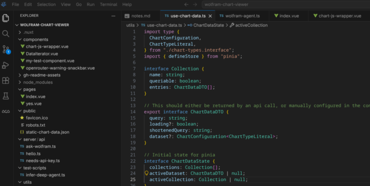

Well, this sight should be familiar to any dev! However, this is
also somewhat of a cliche screenshot because you've likely seen a
shiny, photoshopped, and "glamorous" variant living around
somewhere on the internet.

Mine's pretty plain, but also has a lot of files inside. This
screenshot though didn't have all this code (and some test files!) in
the beginning.

Because the goal here was to learn new technologies and put
something together in that process, the approach was to "work on
the job", but break things down into a task -> learn ->
execute process:

* What problem do I need to solve?
* What documentation covers this?
* How do I put it together?
* Ok uh, what broke?
* Is it working? Keep moving & record the milestone!

Sometimes it's just for a simple thing, but other times it's an
onion layer, *especially* when consuming core concepts that
vue may treat differently.

### Example: Bun -> nuxt -> vite

I actually wound up trying to pursue a purely bun-based approach
to deploying the project. There was a previous project that could be
easily referenced; grab the core concepts, accept the internal
routing system of bun itself, import the vue library, setup a
component, aaaaand

Nothing...

Well, it turns out I *didn't* understand that:

* I was building an architecture related to the *previous*
  version of vue
* Just simply importing vue doesn't allow for a dynamic build,
  which is required for a lot of core features
* A lot of plumbing would have to exist (imports)
* Oh yeah, and the docs for vue I was seeing were also out of
  date!

That didn't work out, so what's really the right way to do that?

First, I need to have a vue-like base that bun is happy with.
Searching through bun's docs on their website brought me to nuxt, it
has automatic imports (invisible plumbing), allows for using compiled
vue at runtime, has a builder to get you started with a base, and is
based on vite. Excellent

There is one thing that I needed resolve though: **a
client/server model**.

Nuxt by default uses SSR & hybrid based rendering. To use
**LangChain** later, I would rather have client/server
separated. This is where learning by LLM worked out:

I simply asked it what was necessary to make it server side only -
it takes the nuxt MCP, discovers you can perform some configuration
changes, and it's there! It also provides me a link to navigate to
about this specific issue.

"Apply this for me!" - done... almost

Turns out, it's *also* possible to just have a pure
client/server side render. I was still trying to do a hybrid
approach: apis were purely server, but some pages could be toggled as
SSR/hybrid. Not what I'm looking for

Another request into the LLM, and it also learns that you just
need to have the folders structured through a standard nuxtjs best
practice, and the routing system would automatically take care of the
rest. It also suggested to remove that config created earlier, since
the method was purely to be client/server only.

Everything could now render. I placed in some test components to
see if they worked; vuetify components operated, the test api
returned correctly, chart.js rendered, all was well!

### Rinse and repeat

All of this is just one part of the entire adventure.
Concurrently, a timer was also running to help me keep track of
progress, notes flying around, and seeing it operate in real time for
each individual thing.

That's the process of problem solving itself. Navigation of the
unknown happens. There's no shame in not knowing, in fact that's what
you're being paid to do - solve problems you don't know. It's
iterative, you'll get it wrong until you get it right.

If you can do that, you'll be on a roll!

### How much LLM usage was in the cards?

I put this in the middle here because I've been talking a lot
about agentics and how it's been able to help throughout this
process.

How much AI did I really use during this whole thing? For
learning: a lot, mixed in with real docs, trial and error.

For implementing: I used about 30%. There's an alternative project
I haven't finished yet that's actually 100%, a vibe-coded project
using the BMAD-method to really tackle things. If I'm being very
honest, the difference between me learning in this project versus the
vibe-coded one feels like a night & day one.

Both are introducing me to new concepts, but actually being *on*
the metal has been good. The code is that reference point between
action & intent, so seeing how it operates is useful. There are
some pieces of gruntwork that actually make LLMs very useful - for
example moving a large chunk of code into a component. You already
know all the ins and outs of a codebase portion, it's just a matter
of moving around the plumbing. That genuinely is a good boost to keep
the project flowing.

A very honest piece of what happens too, are the small things that
someone going into a framework for the first time wouldn't catch. The
prime example for me is the difference between @ and : in vue
components. One simply initializes a variable, while another
configures a listener. Would I know this at the start? No! But to
translate that intent, LLMs did a great job at saying "that
looks wrong and here's why on a granular piece of paper if you
desire". Another is v-if - conditionals in react have a
templating syntax where it involves curly brackets {}, and whatever
block is rendered inside disappears if the condition is false. In
contrast, v-if *is* the component that will disappear if the
condition is false. That had me thrown off, and the LLM correct my
course.

Do I trust it all? Frankly, sometimes I fight back! And once
intents are synced, sometimes, the LLM will re-align and realize "oh
wait, he *actually* wants this". So it's matter of taking
what you hear, and seeing how it applies to *your* use-case,
which is where it very much matters.

So then, I'd very much summarize it as:

* LLMs helped me to figure out the small vue-based nuances
* It would either point out the error so I go fix it, or it
  fixes the issue
* Grunt-work absolutely: type-checks, zod structures, component
  transfer
* Sometimes, direct implementation such as the card selector
  component, based on an already existing template from the docs (so a
  pinch of both LLMs and real docs)

In every step, I require an understanding of the process. Not just
a vague understanding, but something strong so I can troubleshoot it
later if I have to. We're learning something new after all, every bit
of understanding is needed to get this right.

Also for the record, the models were open-weight if you'd like to
know! They were Nemotron Ultra, and Kimi 2.7 code.

---

Much of this process was continuous and kept going on for each
item that needed to be put together. Once it was all orchestrated,
the application coming to life was a sight to see! Dynamic charts,
curious questions, and a way to view all of that with flying colors.

Speaking of dynamic questions! I got to use something I'm
specifically documenting here:

## Agentics & LangChain

I've *always* wanted to use langchain in a project since
hearing about it, and I'm really happy this one got to be it.

This is it's own section instead of being in the implementation
because I have a feeling there's some stuff you might find neat! (But
also I'll be honest... I just genuinely like the tech)

So we're on the back-end side of the equation, and we're looking
to grab data. How do we do this? Well, we're going to use something
called "**Deep Agents**" for this.

What are those? Well, let's quickly break this down - there are
three langchain concepts I think about:

* Chatbots
* Agents
* Deep Agents

At each scale, the complexity increases.

Chatbots are language models that aren't connected to anything
other than some text telling who it is, and what it can talk about.
*No connection to the outside world whatsoever*. In the
langchain course, they stay on this concept for *one* lesson,
in a *single* module - it's the bare minimum, and there's not
a lot we can do with it. We can do more than just that!

Therefore, **Agents** take that further. They *do*
have connections to the outside world, via MCP servers. The context
is isolated, but can be appended to by recursive rounds of back &
forth.

**Deep agents** are the final frontier of the
previous concept. Yes, agents alone could do what this project is
looking for, but instead manually chaining all the responses ourself,
deep agents do this *for us*. With a deep agent, it can do
more than just one round of MCP calling, it can do *many*.
Also, beyond our scope, it can open the file system, grab skills,
view AGENTS.MD, and have the ability to write changes to files you're
looking to change. Not that a normal agent can't do that, but the
context for all of this is retained, and enacted upon a single turn.
Sub-agents can also be used from here as well, so multitasking can be
accomplished.

So then! Disabling everything else, we can use deep-agents in this
project to gather multiple calls to **Wolfram Alpha**
via it's respective MCP server.

Although... after getting everything, how do we tell the agent how
to construct a chart?

### Zod

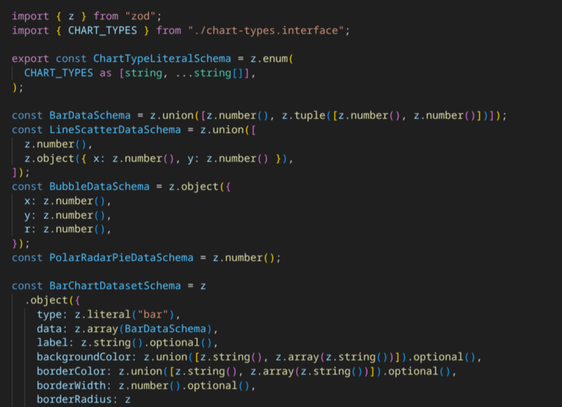

These are type definitions a front-end developer would be familiar
with if you're dealing with something like an openapi spec, or just
trying to verify if something looks like the correct shape of
something at runtime. It's different from TypeScript types, in that
they are programatic versus just for the developer.

In our case, it's the blueprint langchain requires to tell an
agent "this is how to output your findings". The types for
chart.js are actually *painfully* dynamic, which is why in the
file being displayed above, a lot of this was actually in fact
generated by AI itself

It needed to convert from ambiguous TS types over to zod, so a
gruntwork task. It got that done decently quick and we were off to
the races.

---

The pipeline now looks something like this:

* Figure out the user's query
* Break it down into smaller queries to search for in wolf ram
  (it searches like you and me, with keywords)
* sift through the results
* transform the results

And the result? Something like this!

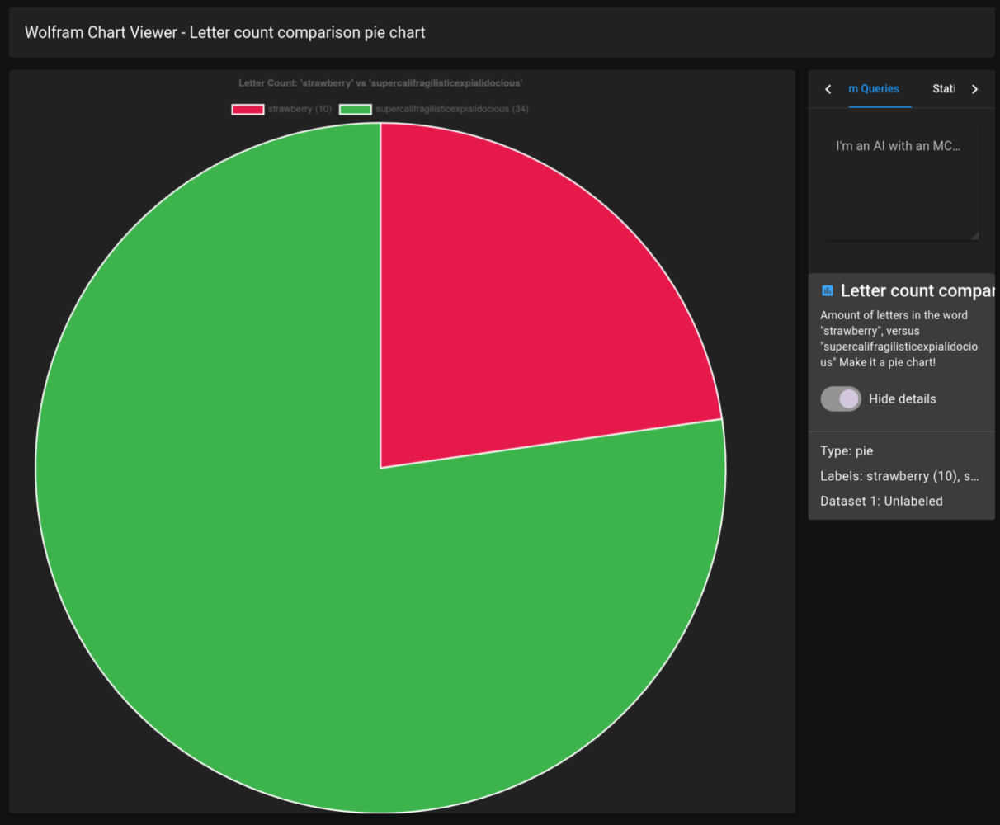

Yeehaw!!

### And then there are bugs!

Except, well... while I got this one right the first time, other
times it might freak out and get it all wrong.

And I'm not afraid to say that! Here's the thing, what we did can
be improved upon. Due to time constraints I didn't originally, here's
what's wrong when it does get incorrect:

1. Everything is one task (parse user query, fetch results until
   you get what you're looking for, transform, oh yeah remember what
   chart & colors the user wanted?)
2. It was not broken down into sub-agents (or in better case, a
   non-async chain of sub agents)
3. context window is high

If we can break it down systematically, it would be entirely
possible to make this process cheaper and more efficient. It's got
GLM5.2 under the hood, I betchya a $25 that we can make it run with
gemma 4 with all those optimizations.

Therefore that's what I sought out to do! Because of context
overload, sometimes chart data doesn't return right, and that's a big
problem when you just spent tokens on a query the user wanted to know
about.

## Learning to use my own app

The above can have some design improvements, but in the meantime,
can we get specific?

Yes we can! The behavior of such a beast can be tamed if we
understand how to say things right.

Instead of:

How large is the
moon vs the earth?

We can say:

> How large is the moon vs the earth? Output must be a donut chart, value must be in "miles", color of the chart should be cream-yellow for the moon, blue for earth.

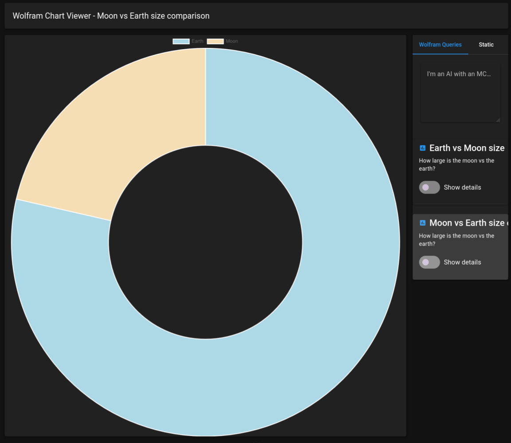

And as you can maybe see, there's more than one attempt. (oof...)
On the first one, the AI forgot to add in the colors.

All of which can be fixed by using sub-agents and transforming the
context. (One agent has the core question, another has the results &
transformation details)

Nonetheless, getting specific absolutely helps, and we can get
some very cool results as you can see from the previous screenshots.

## Planned Future Upgrades

I'm definitely not done with this one! After everything that's
been said & done, this would be a great project to keep evolving.
Some ideas I currently have on the table:

* Saving & deleting queries, so that you can refresh the
  browser page and remove extra queries respectively
* Sub-agent delegation (as mentioned earlier)
* More MCP resources, and perhaps easy customization! (e.g
  Wikipedia, openrouter's MCP)
* A different theme besides dark!
* Prompt injection (so preventing the LLM from doing something
  it shouldn't)
* More elastic data verification (so that cheaper models can
  format the data)
* Behind the scenes plumbing and fixing of one-off bugs

It's something worth tending to, for this to be the best project
it can be.

## Retrospect

We're pretty down far on this page, but by the time you're reading
this, it should be clear:

A lot was learned!

I learned about how vue behaves, learned to love it, got a bunch
of ecosystem basics in the bag, and came out the other side.

Is the project perfectly meticulous? Not at the moment, but the
real lesson that I learned was that it's entirely possible to switch
things around and deep-dive into a ton of information. Enough to
genuinely bring the knowledge needed to do new and exciting things!

I'm very glad to have gotten my eyes on new stuff. Before this I
didn't know a lot about vue; it's one of my favorite frameworks now
and wouldn't be mad if I took it to build something else next time.
I'm also genuinely happy to have been able to finally use agentics
within a real project, and it bearing real results. It's something
I'm ecstatic about, and looking forward to seeing where this can lead
things into the future!

# Hello from LinkedIn!

Well... this is a little backwards!

Normally I would be posting the page here first and *then* putting it onto LinkedIn. What's going on?

Well, this time I thought I'd try something new - the results were interesting:

1. Write the post on linkedIn
2. Copy the entire page (Rich Text Format / RTF)
3. Paste it into libreoffice (formatting and images were retained)
4. Save as (not export) - webpage, which made an HTML file, and exported links to pictures in the associated directory
5. `uvx markitdown[html] page.html > page.md`
6. Tell gemma to re-name images and put them into `src`!

Most of this pipeline was good - seems like though when I exported, it attempted to format the plain text and broke quotes, but other than that, fixing them later was less of a hastle than fixing *everything* after attempting to put it in linkedIn.

Objectively this was a better experience, with the main challenge being that LinkedIn's editor is not as stable as a markdown environment. If it ultimately means a faster experience writing these things, I'm not opposed, but we'll keep navgating through this!

Here's a link to the original LinkedIn page: [How I learned Vue and built an Agentic chart app over the weekend](https://www.linkedin.com/feed/update/urn:li:activity:7495122415975436288/)
