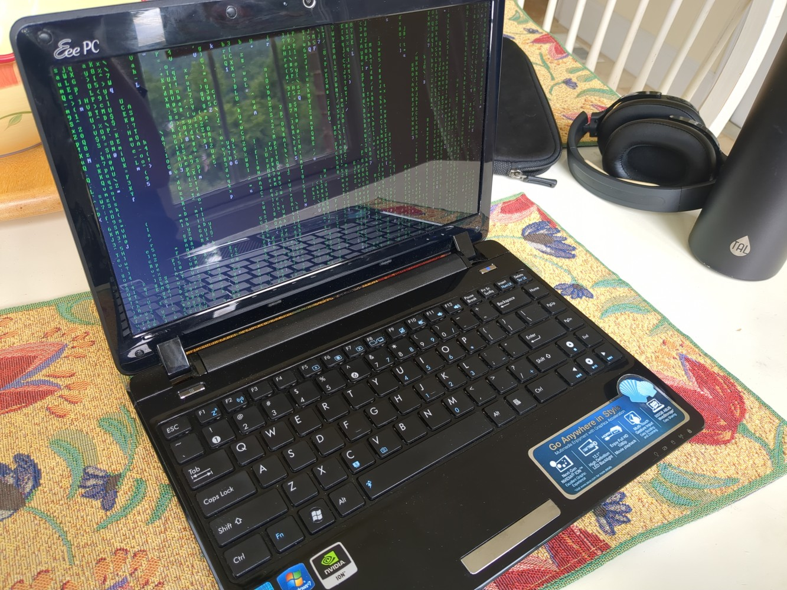
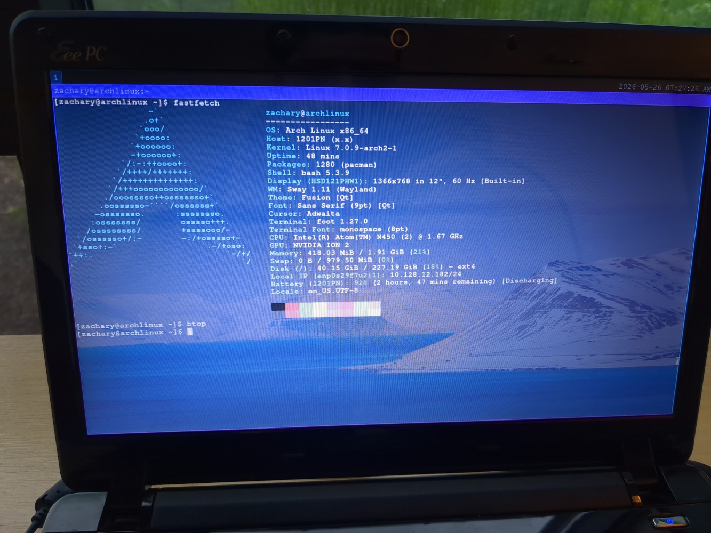
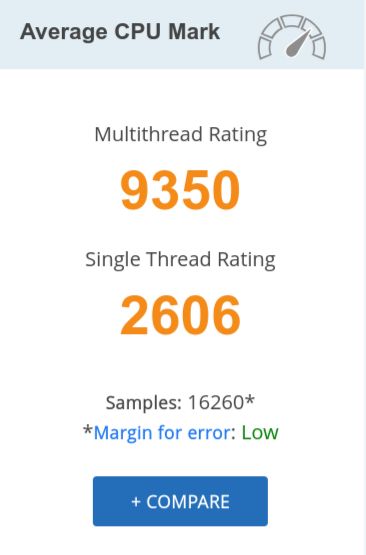
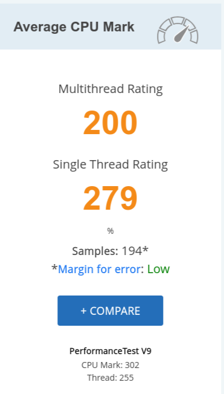
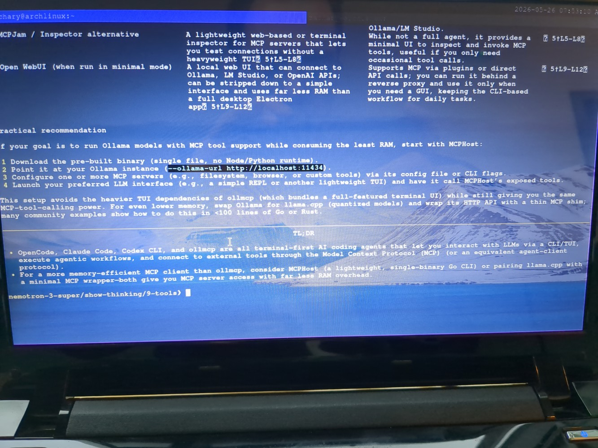
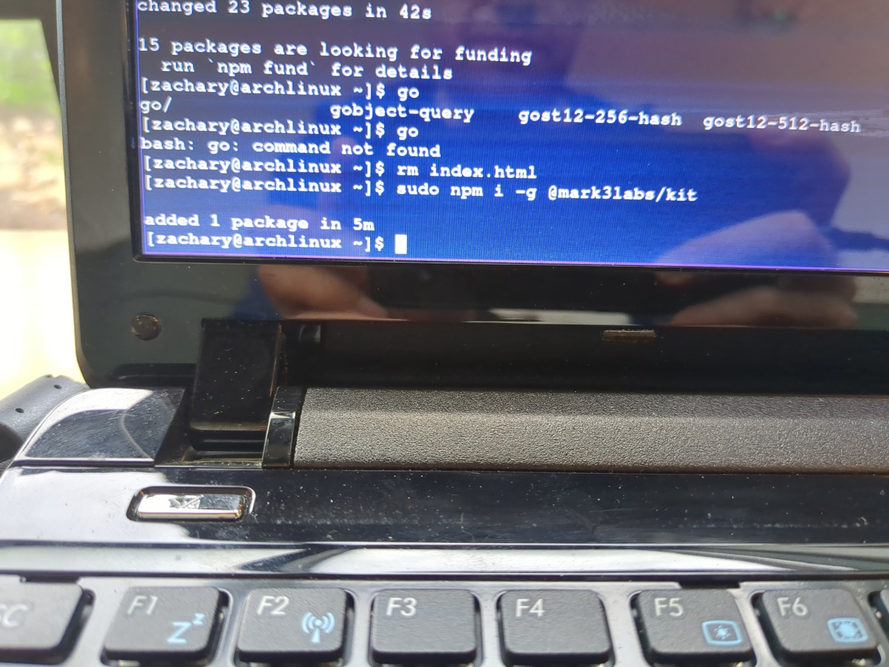
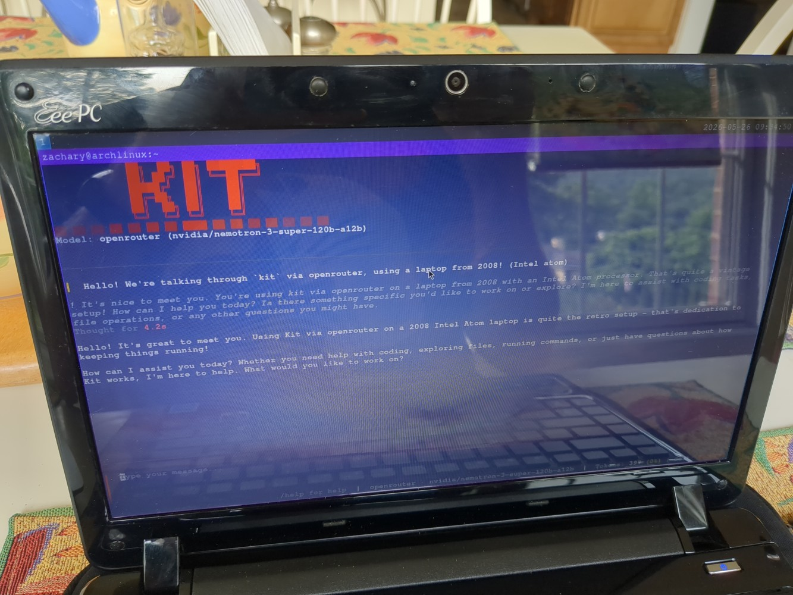
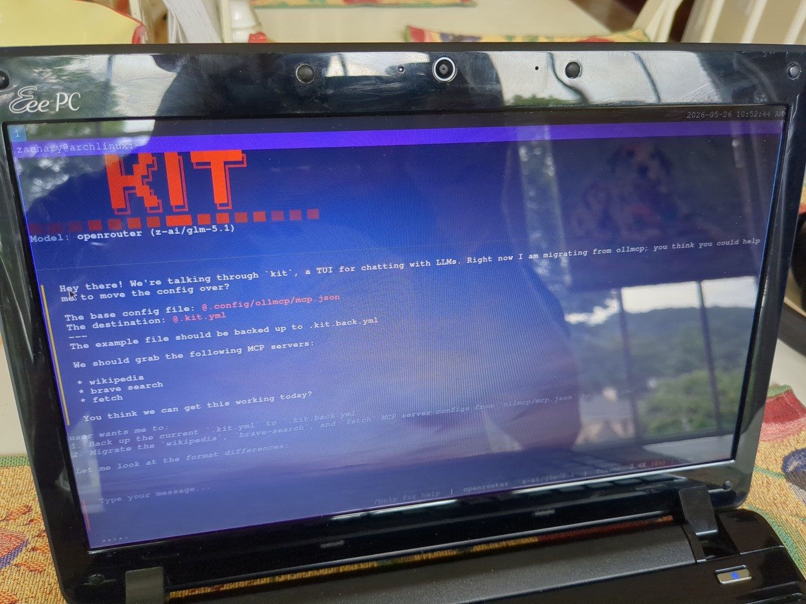
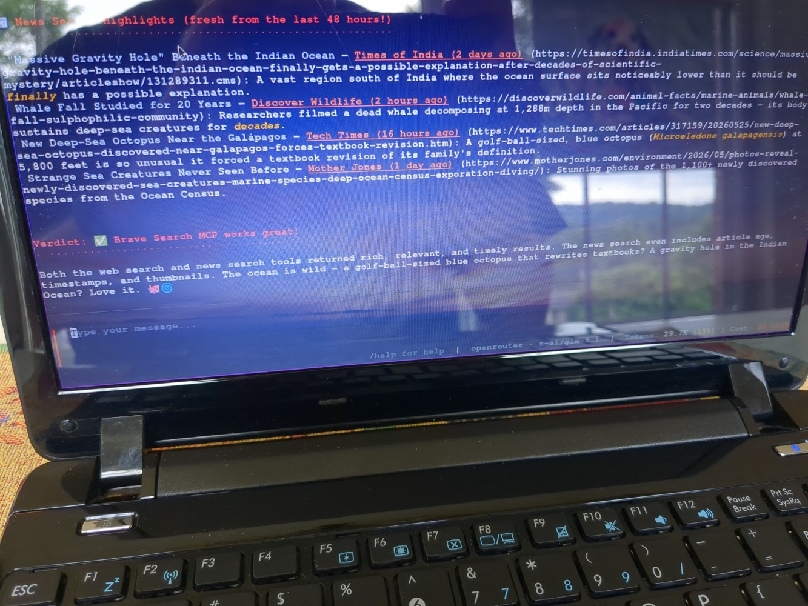
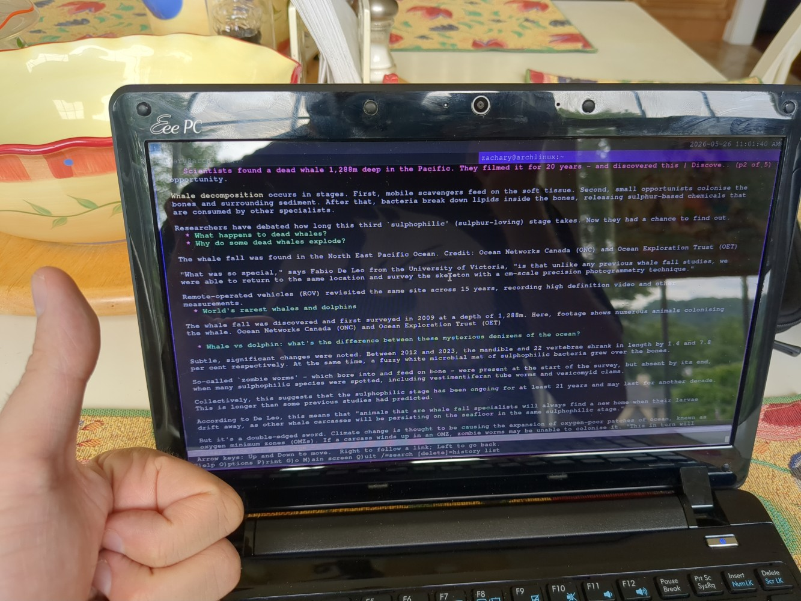

<!-- Hi! You might be an inquisitive one and realized this article came around *before* this repository existed.

That is indeed correct. This was before I did markdown for the primary method of formatting my pages. Yet somehow this is here. Well, the pipeline was pretty simple:

* Clicked "edit" on linkedIn to grab the article
* Copied all the things (Rich-text format)
* Pasted it into libreOffice writer (RTF -> RTF)
* Saved it to HTML
* Used this converter (if I run into this situation again, perhaps something else could be used) https://www.w3schools.com/tools/tool_html_markdown.php
* Did final touches by replacing image names (because the libreOffice export also exported the pictures)

I have the feeling this could be better automated through something like markitdown, which would help me skip the html step; though I don't have good reception right now so I didn't have a chance to download the edgecase. Should probably try that out next time!-->

Yep, you read that correctly. And now you might be thinking to yourself "Ok... What? Why? How? Uh"

Completely valid reaction, it's gonna be ok. We'll answer all of that, starting now!

## Why?

*Limitations breed creativity* - in fact I believe this strongly!

In an age where so much is being done for you, whether through SaaS, sophisticated apps & software, high-end hardware, and very simple solutions or shortcuts, we receive an abstraction of what we'd like to ultimately do

Many times, this can be good! Other times, not as much, as you lose control over more granular parts of the process. As more things are driven for the sake of convenience, apps get more complicated, which requires more hardware, and that means more energy and expense. (And I acknowledge the full irony of that statement as we're literally talking about running an agentic setup, but bear with me)

You might even start to notice that as things evolve, old hardware begins to not work with it's base setup anymore; apps can no longer be updated, and then you're left with a brick that's using stale has vulnerable configurations, unable to move forward to new things.

That *would* be the story of this netbook, but as others in the linux community would also say, "I refuse" - in fact, this netbook can still do a lot!

Machines of this caliber need the right tools at a scale it the processor can munch on. If you give it something really big, like windows 10 or 11, it's gonna suffer from all the bloat. Conversely if you keep things lean (which you'll see shortly), then things soar with flying colors.

With limitations re-thinking how to do something; it's a practice you can take just about anywhere - almost every time I learned something new on that laptop, I've also taken it over to my modern framework 13. It scales valiantly and makes computing as a whole that much more pleasurable because you better understand the machine from the inside out.

Speaking of which... what is that machine we're talking about?

## What?



**Meet my son!**

His name is EEPC-1201PN, or the "Seashell" for short. He is roughly 16 years old, and I've watched him learn to walk, talk, and play - he warms my heart greatly.

Here are some of the specs the seashell has:



For those that can't see the image, here they are on paper:

- CPU: Intel Atom N450
- GPU: Nvidia ION 2
- Memory: 2GB DDR2
- Wifi: 2.4 GHZ band only
- Battery: 2-3 hours (third-party battery, the old one could only last 1 hour)

That's hardware, for software:

- OS: Arch Linux (migrated from windows 7)
- Kernel: 7.0.9 (Closest to latest as of this writing)
- Window manager: Sway

Now, all things considered I'm a software guy, not a hardware guy; so what is that N450 CPU capable of exactly? Well, let's put things into perspective - here's a [cpubenchmark.net](http://cpubenchmark.net/) score for my framework 13 laptop being used to write this post:



Hey not bad! Now, here's the seashell's CPU:



I'm not an expert or anything, but a **33.5X** difference in performance might be just a pinch less powerful than a modern laptop.

### More with less

And yet, there's a lot we can do!

The key here being that, again - for the laptop to do things, we need to provide it with solutions that are more this thing's speed. Linux and FOSS solves this quite a bit by offering many things to us. Here's just a taste of what we can do in the modern age, despite an old CPU and 2 gigabytes of RAM:

- Browse the web through konquerer / lynx (it's a netbook!)
- Take notes through vim
- Navigate to cloud storage using SAMBA and our local home NAS
- Load up professional documents using the libreOffice suite
- Talk to people in places like groupMe or signal (using pidgin, finch, and scli)
- View project progress via Trello (yes! through a CLI!)
- Listen to music using VLC
- Play either official, or homebrew games (up to portal quality graphics)
- Write code with a debugger (work in progress, but vim has plugins)
- Use AI Agentic workflows

And the cherry on top? The machine at boot & idle uses about 149-184MB of RAM. Wanna keep it that way? Go CLI only and use tmux and a tty.

That's quite a bit; for the most part you could survive on this laptop, *and more*. Many people would overlook a machine that would likely cost around 50$ on ebay, but with enough effort, it can genuinely do a lot for you. It's not easy to do, and sometimes you'll need to let arch compile a thing or two on a separate machine (this processor takes a *long* time to compile rust code); but if you stick with it, a lot is absolutely possible.

### Wait... Agentic Workflows?

Yep, that's possible too, and the story gets interesting from here.

You see, my goal for this post was actually going to be how I managed to get an agentic workflow live on the seashell. But I came to a quick realization:

I hated my current setup for agentic work.

It's there, and it works! Just poorly, and it was rather clunky too. Not that it wasn't bad, but to be honest, I think we can do better.

So instead as I was pulling out the seashell today, I thought perhaps we could instead document a journey of *upgrading* the configuration. Better opportunity than never to explain this whole *limitation breeds creativity* phrase, teased earlier.

So, we did just that, and it's looking so much better.

---

Here's what we're aiming to fix up:

### Ollmcp

Honestly, it's a great application. You can check it out here if you like: [https://github.com/jonigl/mcp-client-for-ollama](https://github.com/jonigl/mcp-client-for-ollama)

The application in question is written in python, and aims to be a method of running MCP servers with ollama-based models. While this machine *can* use very small models, and it's cool to watch (!) (e.g gemma3:270M, granite4:350M), the output isn't something that can be used meaningfully for more advanced workflows.

From here I transitioned to using cloud models, and the current setup just worked seamlessly for that purpose (ollama cloud). I didn't really have to change anything.

The actual MCP side of things is important here - the whole point was to have an ecosystem to touch the spinning drive, run commands, and navigate the web. For that to work, I had the following MCPs configured:

- [filesystem](https://www.npmjs.com/package/@agent-infra/mcp-server-filesystem) - Tiktok's updated port of the official modelcontextprotocol example
- [commands](https://www.npmjs.com/package/@agent-infra/mcp-server-commands) - Another Tiktok port
- [brave-search](https://www.npmjs.com/package/@brave/brave-search-mcp-server) - This is a first-party mcp server by brave themselves
- [fetch](https://github.com/modelcontextprotocol/servers/blob/main/src/fetch/README.md) - de-facto example tool for grabbing web-pages
- [wikipedia-mcp](https://github.com/Rudra-ravi/wikipedia-mcp) - Optional server for grabbing wiki pages

Basic things, such as getting a file or running a command required an MCP server that would otherwise be built-into common clients. It's worth noting that ollmcp is made to be an educational tool, in that it provides a clean-room environment to test MCP server output. You can fully use it to run workflows, but none of this came out of the box when I configured it the first time.

Oh yeah, and you shouldn't use all of these at once. We have 2GB of DDR2. Each MCP server can range from being 70-100MB in load size. That does indeed add up, and if you're running a GUI, this is going to go all the way up to 500MB at worst, plus ollmcp (100 *more* MB), and you get whopping total of 1.1GB or more. Not terrible, but we're going over half the resources when we could also be talking to our friends, writing a document, or playing a game. So then, the solution to that is having many configuration files to have "categories" of activities (e.g *research* would have wikipedia and brave, *action* would have commands and fetch)

---

This previous configuration worked alright and bore fruit. It helped me do things like learn driver configurations for this device, expand configuration on apps like screen or tmux, and successfully wrote an ncurses app using python and a PRD.

...a PRD? Yeah, well you've probably guessed, but ollmcp doesn't have a plan mode either. PRDs give it the correct amount of context to assemble something with accuracy, which is what plan modes also do in things like opencode and cursor. Not a large change, but you can absolutely do that.

Did this whole Frankenstein monster of a solution worked? Absolutely. Was it perfect? Not really - in fact while it was exciting, there have been times where the MCP servers would spit out a lot of python exceptions for no good reason and ruin the terminal. It still gave out a result in the end, but sometimes things would crash, I'd have to manually set things up again, and that can get annoying.

I think it's time to move on, let's see if we can do better.

## How?

Great question! I had no idea. But you know who might know? Nemotron alongside his sidekick, ollmcp and brave-search:



Alright nice, something called [MCPHost](https://github.com/mark3labs/mcphost) - sure let's try that!

Let's check out the github page and... oh, it's a public archive now. Hmm...

Ok, well at the very least there's a linked successor - it's called [Kit](https://github.com/mark3labs/kit). It's written in go like it's predecessor, so it'll be a binary instead of a python script which should speed a lot of things up.

It also has a lot of pre-baked features, like openrouter & ollama support, file inference, built-in file reading, and built-in command execution. Later I discovered these features did miracles and cut MCP usage down by 200 Megabytes, sweet! The power of being scrunched into a single binary!

Though now we need to install it, but before we do that, you might honestly be asking something important:

### Why not just use opencode?

That's a great question! I'd love to, but there lies one road block:

It can't run on the CPU

Well, more like bun, the JS runtime behind the scenes, can't. The binary was not targeting the architecture for this old thing, but honestly, it's valid - it's not like someone would try to run bun on this thing... right?

Yeah well, someone did, and now they're sad a 16 year old laptop can't use opencode. 😑️

There is an option we could do, which is compile bun from source on a more powerful machine, then transfer it over to the laptop. I've done this several times in order to get working binaries. If we tried compiling on this laptop, it'll first of all take literal *hours*, but second, it would probably destroy the swap space on this thing, and therefore the spinning mechanical drive. Probably not the best approach.

Given that this process would take a while, and I'd most likely need to do this *many* times to keep it up to date, as the repository entry for this thing is going to frequently update, it doesn't seem worth it to me personally.

This is where I would have also made a tangent of "Even if opencode worked, file, fetch, and command MCPs would bloat the system". Though to my surprise kit does a brilliant job at keeping that tiny, so I won't complain if opencode theoretically did the same thing.

### Let's install kit then

Alright, here it goes!

```
npm install -g @mark3labs/kit
```



Heck yeah, record time at 5 minutes.

I don't think it was the processor though, the wifi I was using around this time was painfully slow. All things considered this thing *does* have 2.4Ghz wifi, *and* the only one available was the building next door. Given this, and I didn't want to use a hotspot, I decided to head back home from this coffee shop.

Running kit for some reason did not trigger the command like the instructions said though - that might be a problem. It turns out the global install *did* in fact put down a command into /usr/bin, but it was a broken symbolic link to a node-modules command that didn't exist.

It pointed instead to the *directory* it was stored in. That didn't exactly work for obvious reasons, so as a userland patch, I created an alias to run the *real* command, which was hidden away in that same path:

```
alias kit=/usr/lib/node_modules/\@mark3labs/kit/bin/kit-bin
```

Then, we also would like to switch to openrouter during this transition; so iet's provide an api key:

```
 export OPENROUTER_API_KEY="sk-or-v1-xxxxxxxxxxxxxxxxxx"
```

This is saved into our .bashrc file. Now we just close the terminal, say the magic words:

```
kit -m openrouter/nvidia/nemotron-3-super-120b-a12b
```



Awesome! We're up and running!

How much RAM are we using right now by the way? Well we're just shy of 565MB. I left ollama on by accident, so in theory we'd be at about 500MB without it.

### MCPs

Alright, next and final step; we have some MCP servers that need migration. The good news? We can eliminate two: commands and filesystem. kit has this built-in, and saves us a lot of memory by doing that. (200MB)

The remaining are:

- wikipedia (I commented this out later, it's not used often)
- brave-search
- fetch

I'm surprised fetch isn't a thing here, but that's ok, we still have the tool from the previous config. Ollmcp's config is based on JSON, but kit's config is YAML.

We don't need to re-write the config ourselves - this here is the fun part: just let GLM 5.1 do it!



The magic happens - excellent; now let's re-start Kit and test out the web-search. I asked it to search for something it liked, and well:



It decided that it wanted to search for marine life, and succeeded!

And just to confirm it wasn't a fluke, let's use lynx to visit one of the results:

```
lynx https://discoverwildlife.com/animal-facts/marine-animals/whale-fall-sulphophilic-community
```



Looking good! That's a real page, not hallucinated.

Viewing the RAM usage one last time, it sat at around 906 MB. Minus the accidental ollama service, that would make 840MB. Should we decide to run everything cli-only? Removing sway and it's terminals takes it down to 428 MB.

## How is it overall?

So far the interface feels great. It reminds me a lot of opencode, but just less cluttered. Commands for the app itself (not prompt-based commands) are very easy to bring in. There's options to change the model on the fly just like opencode as well. Sessions? That works too ( /resume)

Some current drawbacks:

- I don't see a "plan" mode just yet. It's likely possible to get around this by just technique - via the PRD mentioned earlier. Alternatively you can save the session context and restore it in order to have a summarized plan, but that might be more bulky because it contains more context than just the pure mission
- The "slash command" ecosystem that cursor, claude code, and opencode have doesn't really exist (at least I don't think so); there's a go-script that creates a "slash command", but I don't think it's related to plain-text markdown files that instruct the model to do a complex agentic routine. (you can get around this too by Just inferring files. Clunky, but works)
- And a big one for me, it's not possible to turn off individual MCP tools in-app. (e.g cursor can do this) Specifically in-app, because it *is* possible to do this within the yaml config, but that means you have to restart the app each time you want to disable something. Big deal? For most no, for my laptop it's more of a nitpick since MCPs take up to 15-20 seconds to load sometimes.

Cozy comforts aside, this is rock solid. It otherwise has a ton of things that opencode does (like oauth-based MCP authentication), and even has a *very* large selection of providers beyond opencode; ollama included.

Would I go back to ollama at this point? Honestly, probably just for local models on beefier machines. I would use ollama's cloud, but they have recently started to gate bigger models with a subscription. Which ones? I couldn't tell ya, as they don't label them, and the only way to discover it is by trying a model to see if it can be used. (rule of thumb, bigger models). I can get a cheaper deal by using a pay-as-you-go model at this point.

## That's all!

Thanks for taking a look at a blog post with potentially some sarcasm and humor along the way. I thought it would be fun to share one of the core things that legitimately taught me a lot about how to construct an agentic configuration with just about anything.

While I'm a software engineer by trade, I love to get things working on the operating system level with high efficiency. It's a fun side-hobby and teaches me a lot when learning to navigate problems. When *limitations breed creativity*, there are lessons learned that scale - so I hope to take that wherever I go out to experience something new.

In an age where macbook pros can go between 32GB and 64GB + of unified memory, remembering how to navigate under just one, can bring forth an unforgettable adventure, and a reminder that we can do a lot with what's in front of us.

Hope your day is a good one - see you later!

